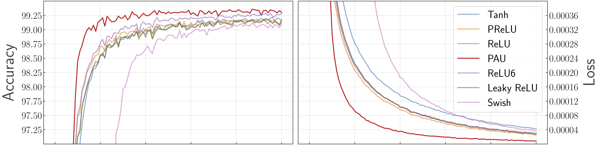

# PAU - Padé Activation Units
Padé Activation Units: End-to-end Learning of Activation Functions in Deep Neural Network

Arxiv link: https://arxiv.org/abs/1907.06732

## 1. About Padé Activation Units

Padé Activation Units (PAU) are a novel learnable activation function. PAUs encode activation functions as rational functions, trainable in an end-to-end fashion using backpropagation and can be seemingless integrated into any neural network in the same way as common activation functions (e.g. ReLU).

<table border="0">
<tr>
    <td>
    
    </td>
</tr>
</table>

PAU matches or outperforms common activations in terms of predictive performance and training time.
And, therefore relieves the network designer of having to commit to a potentially underperforming choice.

## 2. Dependencies
    PyTorch>=1.1.0
    CUDA>=10.1

## 3. Installation

PAU is implemented as a pytorch extension using CUDA 10.2. So all that is needed is to install the extension.

    pip3 install --upgrade pip
    pip3 install pau

If installation does not work, please run:

    pip3 install wheel

For CUDA 10.1, download the wheel corresponding to your python3 version in the _wheelhouse_ repo and install it with:

    pip3 install pau-0.0.16-101-cp{your_version}-manylinux2014_x86_64.whl

If you encounter any trouble installing pau, please contact [this person](quentin.delfosse@cs.tu-darmstadt.de).

## 4. Using PAU in Neural Networks

PAU can be integrated in the same way as any other common activation function.

~~~~
import torch
from pau_torch import PAU

model = torch.nn.Sequential(
    torch.nn.Linear(D_in, H),
    PAU(), # e.g. instead of torch.nn.ReLU()
    torch.nn.Linear(H, D_out),
)
~~~~

## 5. Reproducing Results

To reproduce the reported results of the paper execute:

$ export PYTHONPATH="./"
$ python experiments/main.py --dataset mnist --arch conv --optimizer adam --lr 2e-3

    # DATASET: Name of the dataset, for MNIST use mnist and for Fashion-MNIST use fmnist
    # ARCH: selected neural network architecture: vgg, lenet or conv
    # OPTIMIZER: either adam or sgd
    # LR: learning rate
