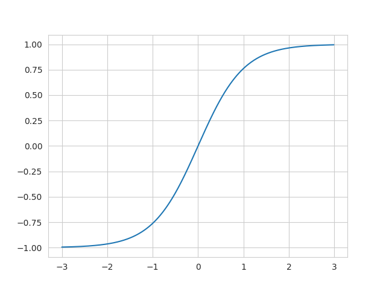
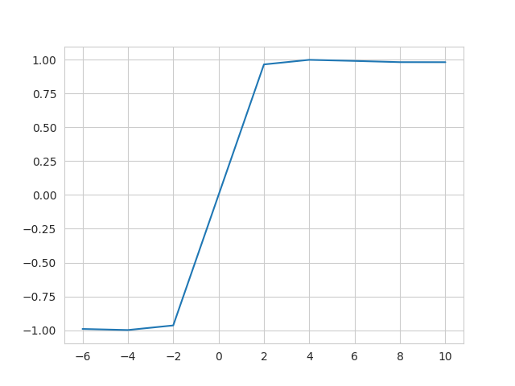

Make the rational Function
==========================

In this tutorial, we are going to visualize the rational function.
First let's create a ratioal functions

.. literalinclude:: code/visualize.py
   :lines: 1-2

Then let's call the :meth:`rational_torch.Rational.show` method to visualize it.

.. literalinclude:: code/visualize.py
   :lines: 4

We can also define the input range:

.. literalinclude:: code/visualize.py
   :lines: 7-8

However, it makes more sense to visualize the function where it is used.
In order to do so, we use :meth:`rational_torch.Rational.input_retrieve_mode` for the
function to save the input distribution.

.. literalinclude:: code/visualize.py
    :lines: 10-11

Let's create random inputs, following a normal distribution and feed our
function with it.

.. literalinclude:: code/visualize.py
  :lines: 13-20

By default, it is only going to save for the next `1000` calls, because
retrieving the input requires to detach the tensors and retrieve them in the
memory, which slows down the coputation.

Let's display the function with its input distribution now.

.. literalinclude:: code/visualize.py
  :lines: 22

.. image:: ../visualize3.png
  :width: 600
